# API E-Commerce de Roupas

Este projeto é uma API RESTful desenvolvida em **TypeScript**, utilizando **Express.js** e **PostgreSQL**, voltada para um sistema de e-commerce especializado na venda de roupas. A aplicação oferece endpoints robustos para o gerenciamento de **clientes**, **produtos** (como camisetas, calças, vestidos etc.) e **pedidos**, com suporte a autenticação via **JWT** e documentação interativa através do **Swagger**.

A estrutura do projeto segue uma arquitetura escalável baseada em **MVC + Service + Repository**, garantindo organização, segurança e facilidade de manutenção.

##  Segurança e Boas Práticas

- Criptografia de senhas com **bcrypt**
- Validação de dados com **Joi**
- Middlewares de proteção (**helmet**, **cors**)
- Padrão **Repository-Service-Controller**

##  Começando

### Pré-requisitos

- Node.js (v18+)
- PostgreSQL (v15+)
- npm ou ban

### Instalação

1. Clone o repositório:
   ```bash
   git clone https://github.com/seu-usuario/api-ecommerce.git
   cd api-ecommerce
   ```

2. Instale as dependências:
   ```bash
   npm install
   ```

3. Configure o ambiente:
   - Crie um arquivo `.env` baseado no `.env.example`
   - Configure as variáveis de conexão com o banco de dados

4. Inicie o servidor:
   ```bash
   npm run dev
   ```

##  Estrutura do Projeto

```
api-ecommerce/
├── database/
│   └── init.sql          # Script de inicialização do banco
├── src/
│   ├── config/           # Configurações
│   │   └── connect.ts    # Conexão com o banco
│   ├── controller/       # Lógica dos endpoints
│   ├── repository/       # Acesso ao banco
│   ├── service/          # Regras de negócio
│   ├── routes/           # Definição das rotas
│   ├── middlewares/      # Middlewares
│   ├── utils/            # Utilitários
│   ├── validations/      # Schemas de validação
│   └── logs/             # Arquivos de log
├── swaggerConfig.ts       # Configuração do Swagger
└── .env.example          # Modelo de variáveis de ambiente
```

##  Banco de Dados (PostgreSQL)

Antes de iniciar a aplicação, é necessário configurar o banco de dados PostgreSQL. Para isso:

1. **Crie o banco de dados** utilizando o script `init.sql` localizado no diretório `database/`. Esse script contém todas as instruções necessárias para a criação das tabelas e estrutura inicial do sistema.

   ```bash
   psql -U seu_usuario -d nome_do_banco -f ./database/init.sql

2.  Configure as **variáveis de ambiente** no arquivo .env, conforme o exemplo abaixo
```env
DB_HOST=localhost
DB_PORT=5432
DB_USER=seu_usuario
DB_PASSWORD=sua_senha
DB_NAME=nome_do_banco
JWT_SECRET=sua_chave_secreta
```

3. Certifique-se de que o PostgreSQL esteja em execução e que as credenciais estejam corretas para garantir a conexão com a API.
>> Após esses passos, você estará pronto para iniciar a aplicação e utilizar todos os recursos da API.

### Diagrama ERD

```mermaid
erDiagram
    CUSTOMERS ||--o{ PURCHASES : "faz"
    PURCHASES ||--|{ PURCHASEPRODUCT : "contém"
    PRODUCTS ||--o{ PURCHASEPRODUCT : "incluído em"

    CUSTOMERS {
        uuid customer_id PK
        string first_name
        string last_name
        string email UK
        string password_hash
    }
    
    PRODUCTS {
        uuid product_id PK
        string name
        integer quantity
        string description
        integer price_cents
        string size
        string gender
        string category
    }
    
    PURCHASES {
        uuid purchase_id PK
        uuid customer_id FK
        timestamp purchase_date
        string delivery_address
        string status
    }
    
    PURCHASEPRODUCT {
        uuid purchaseproduct_id PK
        uuid purchase_id FK
        uuid product_id FK
        integer product_amount
        integer price_cents
    }
```



**1:N customers** → purchases (um cliente faz muitas compras)

**1:N purchases** → purchaseproduct (uma compra contém muitos itens)

**1:N products** → purchaseproduct (um produto pode estar em muitos itens de compra)

## 🛡️ Middlewares Principais

| Middleware | Descrição |
|------------|-----------|
| `helmet` | Proteção de headers HTTP |
| `cors` | Controle de acesso cross-origin |
| `morgan` | Geração de logs de requisição |
| `cookie-parser` | Manipulação de cookies |
| `errorHandler` | Tratamento centralizado de erros |
| `authMiddleware` | Validação de tokens JWT |
| `validateCustomer` | Validação de dados com Joi |

##  Tecnologias Utilizadas

### Dependências Principais

| Pacote | Versão | Uso |
|--------|--------|-----|
| express | ^4.18.2 | Framework web |
| pg | ^8.11.3 | Driver PostgreSQL |
| bcrypt | ^5.1.1 | Hash de senhas |
| jsonwebtoken | ^9.0.2 | Autenticação JWT |
| joi | ^17.11.0 | Validação de dados |
| dotenv | ^16.3.1 | Variáveis de ambiente |

### DevDependencies

| Pacote | Versão | Uso |
|--------|--------|-----|
| typescript | ^5.3.3 | Tipagem estática |
| ts-node-dev | ^2.0.0 | Hot-reload em dev |
| @types/* | - | Tipagens para libs |
| swagger-jsdoc | ^6.2.8 | Documentação API |

##  Documentação da API

Acesse a documentação interativa em:
```
http://localhost:3000/api-ecommerce-docs
```

Principais rotas documentadas:
- `POST /api/auth/login` - Autenticação
- `GET /api/customers` - Listar clientes
- `POST /api/products` - Criar produto
- `GET /api/purchases` - Listar pedidos

##  Arquitetura

```
Requisição → Routes → Controller → Service → Repository → Banco
          ←        ←           ←        ←            ←
```

- **Routes**: Definição dos endpoints
- **Controller**: Lógica dos endpoints
- **Service**: Regras de negócio
- **Repository**: Acesso ao banco

##  Testando a API

1. Inicie o servidor:
   ```bash
   npm run dev
   ```

2. Use o Swagger UI ou ferramentas como Postman para testar os endpoints

3. Exemplo de autenticação:
   ```bash
   curl -X POST http://localhost:3000/login \
   -H "Content-Type: application/json" \
   -d '{"email":"usuario@exemplo.com","password_hash":"senha123"}'
   ```

##  Futuro do Projeto

Este é apenas o começo! A API foi construída com foco na escalabilidade e pode ser **refatorada** ou **expandida** conforme as necessidades evoluírem. Entre as possibilidades futuras estão:

- Implementação de uma **interface web com React**, oferecendo uma experiência completa para o usuário final.
- Integração com sistemas de pagamento, controle de estoque avançado, e muito mais.

>  *O limite de um projeto é o limite da sua imaginação.*  
